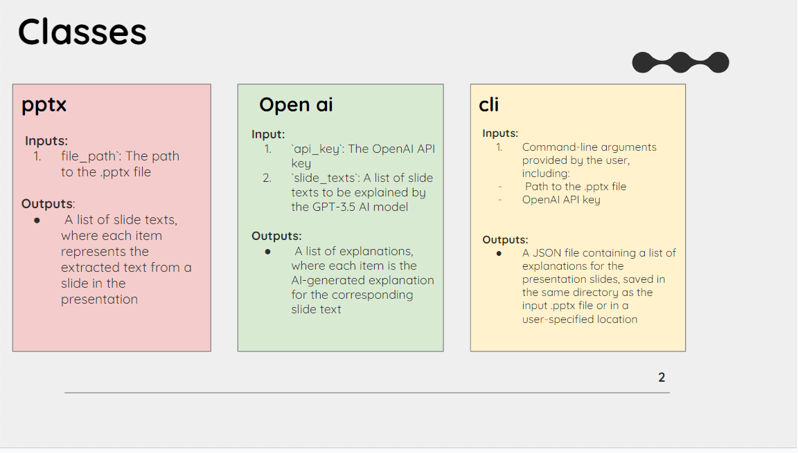

# Class Design

This document describes the design of the main classes in our project.

## PPTXParser

The PPTXParser class is responsible for parsing PowerPoint files and extracting slide text.

## OpenAIExplainer

The OpenAIExplainer class handles interaction with the OpenAI API and processes slide text to generate explanations.

## CLI

The CLI class manages the command-line interface, input arguments, and overall flow of the program.

